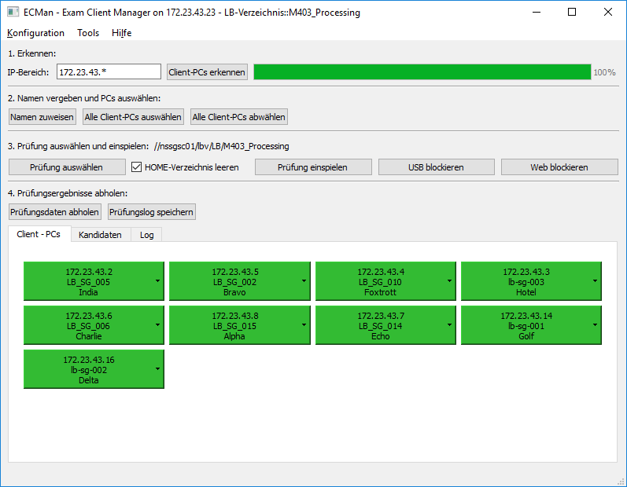
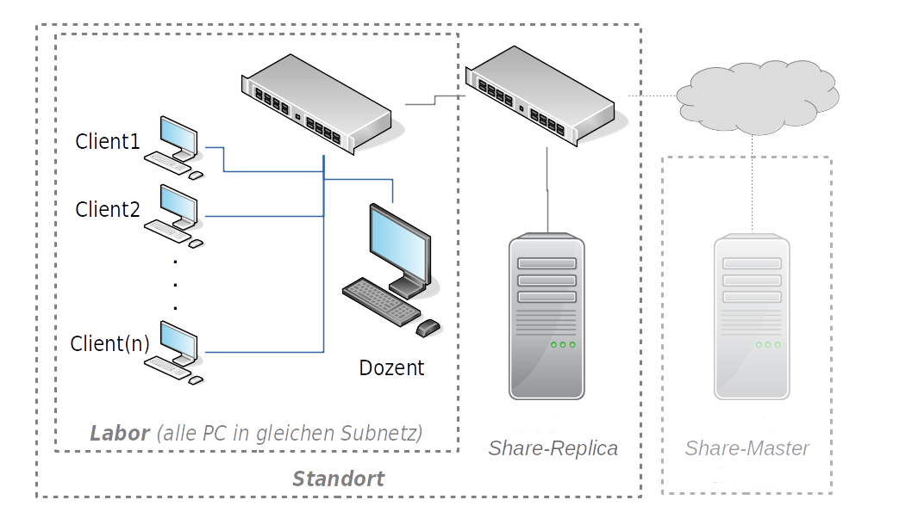

<h1>Automatisiertes Deployment und Retrieval für PC-basierte Prüfungen</h1>

## Management Summary

Eine Softwarelösung soll die Bereitstellung der Prüfungsfestplatten und die Durchführung der praktischen Prüfungen für alle Beteiligten vereinfachen. 

<figure>
  
  
Prototyp ECMan-SW

</figure>

## Ist-Situation

Für praktische Leistungsbeurteilungen werden für jeden Lernenden eine Festplatte mit Betriebssystem, Werkzeugen und Prüfungsdaten eine Prüfungsfestplatte basierend auf einem Master-Image erzeugt.

### Probleme

* Festplatten nicht für Postversand geeignet (hohe Fehlerrate, mangelnder Investitionsschutz)
* zeitlicher Aufwand für Imaging-Prozess: eine Praktikantenstelle
* Prüfungsdaten können von Lernenden per USB-Stick entwendet werden
* manuelles Einsammeln der digitalen Prüfungsergebnisse durch Dozenten mit USB-Stick nach Prüfungsende aufwendig

**Fazit:** Die aktuelle Situation ist ineffektiv, ineffizient und nicht zeitgemäss. Prüfungsrelevante Daten können leicht entwendet werden.

## Soll-Zustand ECMan

Das Softwareprojekt **ExamClientManager** (*ECMan*) soll Lösungen für obige Kritikpunkte liefern. Im Folgenden wird der Umfang der zu erstellenden Deploymentsoftware grob umrissen und der geschätzte Aufwand in Function points (*FP*) angegeben.

### Allgemeines

Die zu erstellende ECMan-SW soll auf Windows 10 und POSIX-kompatiblen Systemen ausführbar sein und basiert grösstenteils auf OpenSource-Komponenten (Python3, PyQt5 u.a.).

Die ECMan-Software wird als OpenSource-Software auf einem Github-Repository zur Verfügung gestellt.

### Ausbaustufe 1 (MVP, Pilot):

In den Prüfungslabors werden Festplatten mit einem Standardimage eingesetzt. Mit der vorgeschlagenen Deployment-Software kann der Dozent folgende Tätigkeiten durchführen:

1. aktive Prüfungs-PCs im lokalen Netzwerk erkennen und auswählen (Win-RM basiert)
1. Prüfungs-PCs mit Namen der Lerndenden verknüpfen
1. ausgewählte PCs auf definierten Orginalzustand zurücksetzen (alte Prüfungsverzeichnisse löschen, falls vorhanden)  
2. Prüfungsdaten  vom Netzwerk-Share auswählen
3. ausgewählte Prüfungsdaten ordnerweise per LAN auf ausgewählten Prüfungs-PCs laden
4. vorläufiges Monitoring der Prüfungsverzeichnisse auf Prüfungs-PCs
1. unerwünschte Netzwerkzugriffe (HTTP, HTTPS, Fileshares, DNS) per Firewall auf den Prüfungs-PCs während Prüfung sperren
2. USB-Zugriffe für Prüfungs-PCs während Prüfung sperren
5. nach Beendigung der Prüfung: Prüfungsdaten automatisiert von den Prüfungs-PCs einsammeln und auf Netzlaufwerk ablegen, Archivierung der digitalen Prüfungsleistungen und Software-Protokolle (welche Dateien wurden auf welche Client-PCs für welchen Kandidaten deployed etc.)

Das Deployment der Prüfungsdaten erfolgt parallel durch Ausführung von Skripten auf den Prüfungs-PCs selbst ausserhalb der Sichtweite der Kandidaten. Die Berechtigung für Dateifreigaben auf den Netzlaufwerken kann auf ActiveDirectory-Accounts der Dozenten basieren.

### Ausbaustufe 2:

1. verbesserte Usability für Zuweisung Kandidatennamen auf Client-PCs
1. automatisierte Modul- und Klassennamen-basierte Auswahl der Prüfungs- und Ergebnisordner
1. exemplarische skriptbasierte Plausibilitätsprüfung für einzusammelnde Prüfungsdaten (inklusive Namen)
2. exemplarisches skriptbasiertes Deployment für aufwendigere Prüfungskonfigurationen für zu definierende LBs
  (z.B. vorkonfigurieren von DBs, Eclipse-Projekte, Android-Studio)

## Voraussetzungen Standard-Image

Die folgenden Voraussetzungen für die Standard-Images sind notwendig:

* Windows 10 mit einem Set der wichtigsten benötigten Softwares (e.g. Java JDK8, Eclipse, Chrome, Firefox, Atom, Sublime, Zeal etc.)
* allfällige Lizenzen (Wndows, MS-Office etc.) sind aktiviert
* **unterschiedliche Host-Namen für alle Prüfungs-PCs im Labor**
* Ausführungsberechtigungen für PowerShell sind aktiviert:

  `Set-ExecutionPolicy -ExecutionPolicy unrestricted`

* bereitgestelltes Konfigurationsskript ist einmalig auf Client-Masterimage ausgeführt
	* Skript aktiviert Windows-Remoteverwaltungsdienst (WinRM, ist Bestandteil Standard-WIN10)
	* Skript erstellt norwendige Firewall-Regeln für WinRM (Port 5985 und 5986 sind offen)
	* Skript erstellt lokalen Benutzer für WIN-RM mit Administratorrechten (Username: winrm, Passwort wird vereinbart)
  * Skript erstellt lokales Sicherheitszertifikat für verschlüsselte Datenübertragung
	* Skript deaktiviert automatische Windows-Updates:
    `Set-Service wuauserv -StartupType disabled`

<!--* Zusatz-Pakete für Powershell: nuget, install-module pshosts (siehe https://superuser.com/questions/725331/how-to-add-remove-lines-from-the-hosts-file)
-->

## Voraussetzungen Infrastruktur

* **funktionstüchtiges LAN (mit DHCP und DNS) in Prüfungslabors** (siehe Abbildung)
* Standort-lokale Netzwerkfreigaben für LBs mit Leserechten (Schreibrechte in Pilotphase) über AD-Accounts der Lehrpersonen. Alle notwendigen Prüfungsdaten werden (nach und nach in der Pilotphase) in entsprechenden Modulordnern (z.B. *M101_Daten*) abgelegt.
* Standort-lokales Netzwerkfreigaben für Ergebnisse mit Schreibrechten für AD-Accounts der Lehrpersonen. Jede Klasse bekommt ihr eigenes Verzeichnis.

<figure>
  
  
Netzplan: alle PCs eines Labor sind im gleichen VLAN bzw. Subnetz. Ein LB-Share-Replica Fileserver befindet sich am Standort.

</figure>

Die Verwaltung der LBs und Ergebnisse kann zentral geschehen. Lokale LB-Shares erhöhen jedoch die Verfügbarkeit und Verarbeitungsgeschwindigkeit des Software-Systems.
