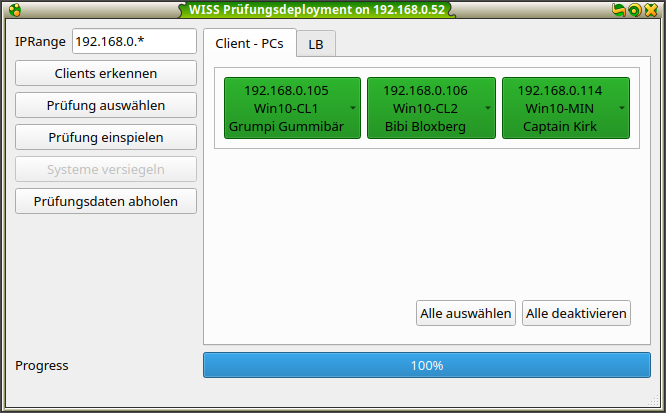
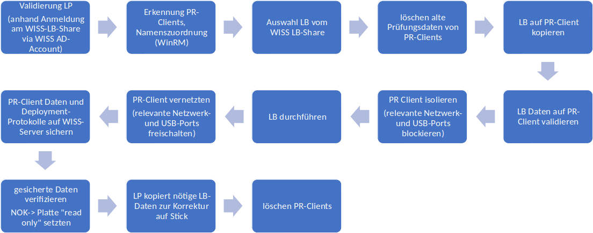

<h1>Automatisiertes Deployment und Retrieval für PC-basierte Prüfungen</h1>

## Management Summary

Eine Softwarelösung soll die Bereitstellung der Prüfungsfestplatten und die Durchführung der praktischen Prüfungen in der beruflichen Grundbildung an den WISS-Standorten Bern, St.Gallen und Zürich für alle Beteiligten vereinfachen. In Folgenden werden Ist- und Sollzustand kurz beschrieben und eine Kostenplanung aufgestellt.

<figure>
  
  
Prototyp ECMan-SW

</figure>

## Ist-Situation

Für (fast) jede Leistungsbeurteilung wird für jeden Lernenden eine Festplatte mit Betriebssystem, Werkzeugen und Prüfungsdaten eine Prüfungsfestplatte basierend auf einem Master-Image erzeugt. Zürich und Bern erstellen sich ihre Prüfungsplatten selbst. Die Prüfungsplatten für St. Gallen werden am Standort Zürich erstellt und per Post oder Kurier geschickt.

### Probleme

* Festplatten nicht für Postversand geeignet (hohe Fehlerrate, mangelnder Investitionsschutz)
* zeitlicher Aufwand für Imaging-Prozess: eine Praktikantenstelle
* Prüfungsdaten können von Lernenden per USB-Stick entwendet werden
* manuelles Einsammeln der digitalen Prüfungsergebnisse durch Dozenten mit USB-Stick nach Prüfungsende aufwendig

**Fazit:** Die aktuelle Situation ist ineffektiv, ineffizient und nicht zeitgemäss. Prüfungsrelevante Daten können leicht entwendet werden.

## Soll-Zustand WISS-ECMan

Das Softwareprojekt **ExamClientManager** (*ECMan*) soll Lösungen für obige Kritikpunkte liefern. Im Folgenden wird der Umfang der zu erstellenden Deploymentsoftware grob umrissen und der geschätzte Aufwand in Function points (*FP*) angegeben.

### Allgemeines

Die zu erstellende ECMan-SW soll auf Windows 10 und POSIX-kompatiblen Systemen ausführbar sein und basiert grösstenteils auf OpenSource-Komponenten (Python3, PyQt5 u.a.).

Die zu erstellende ECMan-SW wird als OpenSource-Software auf einem Github-Repository zur Verfügung gestellt.

### Ausbaustufe 1 (MVP, Pilot):

In den Prüfungslabors werden Festplatten mit einem WISS-Standardimage eingesetzt. Mit der vorgeschlagenen Deployment-Software kann der Dozent folgende Tätigkeiten durchführen:

1. aktive Prüfungs-PCs im lokalen Netzwerk erkennen und auswählen (Win-RM basiert)
1. Prüfungs-PCs mit Namen der Lerndenden verknüpfen
1. ausgewählte PCs auf definierten Orginalzustand zurücksetzen (alte Prüfungsverzeichnis löschen, falls vorhanden)  
2. Prüfungsdaten von Dozenten-PC (oder WISS-Netzwerk-Share) auswählen
3. ausgewählte Prüfungsdaten ordnerweise per LAN auf ausgewählten Prüfungs-PCs laden
4. vorläufiges Monitoring der Prüfungsverzeichnisse auf Prüfungs-PCs
1. unerwünschte Netzwerkzugriffe (HTTP, HTTPS, Fileshares, DNS) per Firewall auf den Prüfungs-PCs während Prüfung sperren
2. USB-Zugriffe für Prüfungs-PCs während Prüfung sperren
5. nach Beendigung der Prüfung: Prüfungsdaten automatisiert von den Prüfungs-PCs einsammeln und auf dem Dozenten-PC bzw. WISS-Share ablegen, Archivierung der digitalen Prüfungsleistungen und Software-Protokolle (welche Dateien wurden auf welche Client-PCs für welchen Kandidaten deployed etc.)

Das Deployment der Prüfungsdaten erfolgt parallel durch Ausführung von Skripten auf den Prüfungs-PCs selbst ausserhalb der Sichtweite der Kandidaten. Die Berechtigung für Dateifreigaben auf WISS-Shares basiert auf den WISS-ActiveDirectory-Accounts der Dozenten.

<figure>
  
  
Ablaufdiagramm: angepasst von Vorlage HGL

</figure>

### Ausbaustufe 2:

1. verbesserte Usability für Zuweisung Kandidatennamen auf Client-PCs
1. automatisierte Modul- und Klassennamen-basierte Auswahl der Prüfungs- und Ergebnisordner
1. exemplarische skriptbasierte Plausibilitätsprüfung für einzusammelnde Prüfungsdaten (inklusive Namen)
2. exemplarisches skriptbasiertes Deployment für aufwendigere Prüfungskonfigurationen für zu definierende LBs
  (z.B. vorkonfigurieren von DBs, Eclipse-Projekte, Android-Studio)

### Function Point Analysis

Die folgende Tabelle beinhaltet das Ergebnis vorläufiger Aufwandsschätzungen und ist unverbindlich.

|  |Internal Logical File|External Logical File|External Input|External Output|External Inquiry |
|:-|:--------------------|:--------------------|:-------------|:--------------|:-----------------|
| Client PC Administration  (detect, configure, getCandidateName)|1|1|1|1|1 |
| LB Auswahl|||1|||
| LBs auf Client-PCs kopieren||||1||
| LB Ergebnisse einsammeln |||||1|
| Gewichtung mit SimpleComplexityRating|7|7|3|3|3|
| gewichtete FPs (1)|7|7|6|6|6|
| **Summe FPs**|32|||||
| Aufwand (Stunden/FP) für Python (2)|12.7|||||

(1) siehe Software Measurement and Estimation, Laird &  Brennan, 2006; ISBN: 0-714-67622-5

(2) siehe http://www.ifpug.org/wp-content/uploads/2017/04/IYSM.-Thirty-years-of-IFPUG.-Software-Economics-and-Function-Point-Metrics-Capers-Jones.pdf; S. 50

### Dokumentation und Training

Für die Zielgruppe IT-affiner Dozenten wird eine Kurzanleitung erstellt. Für die Einführung der Software an den Standorten wird ein Vor-Ort Besuch mit Installation, Demonstration und kurzem Training vorgeschlagen. Dabei sollte ein Ansprechpartner der WISS-IT vor Ort sein. Der Vor-Ort Besuch wird anhand marktüblicher Stundensätze separat verrechnet.

## Voraussetzungen Standard-Image

Die folgenden Voraussetzungen für die Standard-Images sind notwendig und müssen vom Auftraggeber bereit gestellt werden:

* Windows 10 mit einem Set der wichtigsten benötigten Softwares (e.g. Java JDK8, Eclipse, Chrome, Firefox, Atom, Sublime, Zeal etc.)
* allfällige Lizenzen (Wndows, MS-Office etc.) sind aktiviert
* **unterschiedliche Host-Namen für alle Prüfungs-PCs im Labor**
* Ausführungsberechtigungen für PowerShell sind aktiviert:

  `Set-ExecutionPolicy -ExecutionPolicy unrestricted`

* bereitgestelltes Konfigurationsskript ist einmalig auf Client-Masterimage ausgeführt
	* Skript aktiviert Windows-Remoteverwaltungsdienst (WinRM, ist Bestandteil Standard-WIN10)
	* Skript erstellt norwendige Firewall-Regeln für WinRM (Port 5985 und 5986 sind offen)
	* Skript erstellt lokalen Benutzer für WIN-RM mit Administratorrechten (Username: winrm, Passwort wird vereinbart)
  * Skript erstellt lokales Sicherheitszertifikat für verschlüsselte Datenübertragung
	* Skript deaktiviert automatische Windows-Updates:
    `Set-Service wuauserv -StartupType disabled`

<!--* Zusatz-Pakete für Powershell: nuget, install-module pshosts (siehe https://superuser.com/questions/725331/how-to-add-remove-lines-from-the-hosts-file)
-->

## Voraussetzungen Infrastruktur je Standort

* **funktionstüchtiges LAN (mit DHCP und DNS) in Prüfungslabors** (siehe Abbildung)
* Standort-lokales WISS-Share für LBs mit Leserechten (Schreibrechte in Pilotphase) über AD-Accounts der Lehrpersonen. Alle notwendigen Prüfungsdaten werden (nach und nach in der Pilotphase) in entsprechenden Modulordnern (z.B. *M101_Daten*) abgelegt.
* Standort-lokales WISS-Share für Ergebnisse mit Schreibrechten für AD-Accounts der Lehrpersonen. Jede Klasse bekommt ihr eigenes Verzeichnis.

<figure>
  
  
Netzplan: alle PCs eines Labor sind im gleichen VLAN bzw. Subnetz. Ein LB-Share-Replica Fileserver befindet sich am Standort, der Master-Server ist in Zürich.

</figure>

* mittelfristig kann die Verwaltung der LBs und Ergebnisse zentral in Zürich geschehen. Lokale LB-Shares erhöhen jedoch die Verfügbarkeit und Verarbeitungsgeschwindigkeit des Software-Systems.

## Abschätzung Wartungsaufwand

Die grundlegende Funktionalität der verwendeten WinRM-Dienste und Powershell-Komponenten müssen im Falle von Microsoft-Betriebssystemupdates des Master-Images erneut mit Beispiel-Testskripten auf Funktionalität geprüft werden. Die dazu notwendigen Testroutinen werden bereitgestellt.

Alle Programmkomponenten sind entweder in Python3 oder PowerShell6 implementiert und werden im Quelltext zur Verfügung gestellt. Damit kann die Software auch von  Drittpersonen mit entsprechenden Programmierkenntnissen gepflegt und weiterentwickelt werden.

## Kostenvoranschlag und Termine

Da die Kostenplanung für die ECMan-SW anhand obiger Function Point Analysis für die WISS kaum rentabel ist, bietet Green-ORCA die Softwareentwicklung zu folgenden Konditionen an:

### Ausbaustufe 1

Mit Ausbaustufe 1 können Prüfungs-PCs für einfache LBs eingerichtet werden. Die Prüfungsdaten werden automatisiert von allen eingerichteten Prüfungs-PCs abgeholt. Siehe Beschreibung oben. Im Verlaufe des Semesters kann von Green-ORCA (resp. Sven Schirmer) in SG eine Pilotphase für die Module M226A, M120, M152 und M307 betreut werden.

**FPs:** 10

**Möglicher Termin:** 1.3.2019

### Ausbaustufe 2

Mit Ausbaustufe 2 werden zusätzliche Software-Installationen und Einstellungen für Prüfungs-PCs mit LB-spezifischen Skripten konfiguriert. Die Prüfungsdaten werden automatisiert von den eingerichteten Prüfungs-PCs abgeholt und (ebenfalls skript-gestützt) auf Plausibilität geprüft.

Mit Ausbaustufe 3 können deutlich mehr LBs per Deployment-Software konfiguriert und ausgelesen werden. Die WISS spart aufwendige Festplatten-Image- und Versandprozesse. Die Sicherheit der Ausleseprozesse erhöht sich.

*Im Vorfeld von Ausbaustufe 2 ist eine Bedarfsanalyse anhand der existierenden LBs und Konsultation der Fachvorstände zur Abklärung der notwendigen Skript-Funktionalität nötig.*

**FPs:** 10

**Möglicher Termin:** 1.8.2019

Bei entsprechender Resonanz auf Seiten der Dozenten in der Pilotphase kann das Projekt auch arbeitsteilig weitergeführt werden.

  
Niederteufen, 22. Januar 2019   
.................. 
gez. Sven Schirmer

