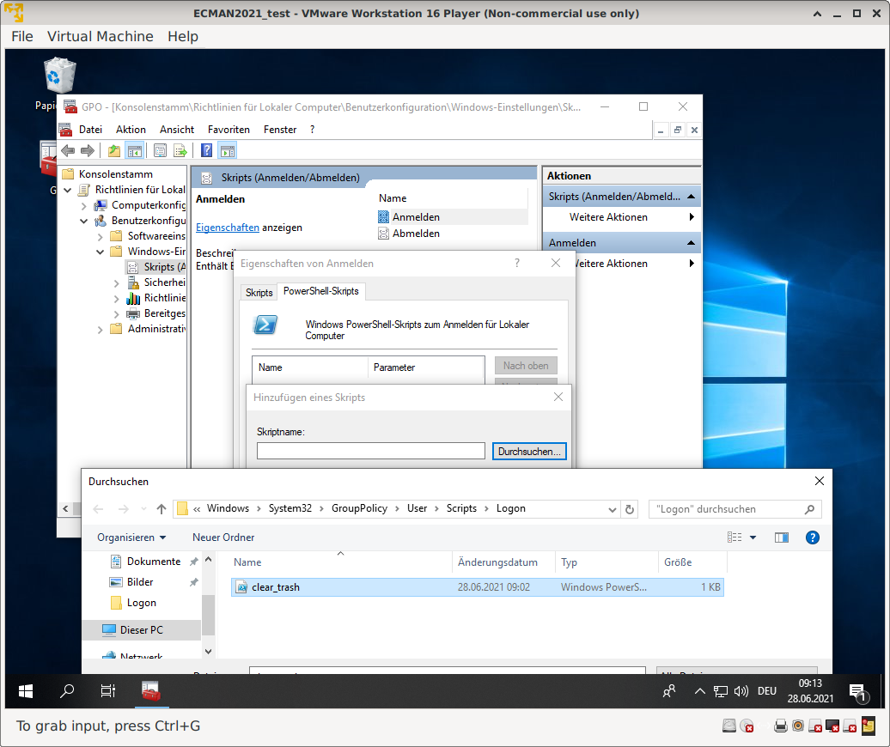
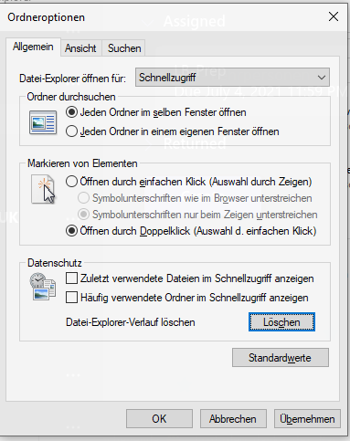

# LB-ClientPC - Konfiguration

Nach dem Ausführen* des ConfigureRemotingForAnsible.ps1 Skripts auf dem Client-Image sind folgende Anpassungen sinnvoll:

1. Hinzufügen des *Papierkorb-bei-Anmeldung-leeren* - Skripts zur entsprechenden Group-Policy 
  
3. Deaktivieren der Anzeige zuletzt geöffneter Dokumente und Ordner 
  

ist das Skript nicht ausführbar, bitte vorab folgenden Powershell-Befehl ausführen: `Set-ExecutionPolicy unrestricted`
